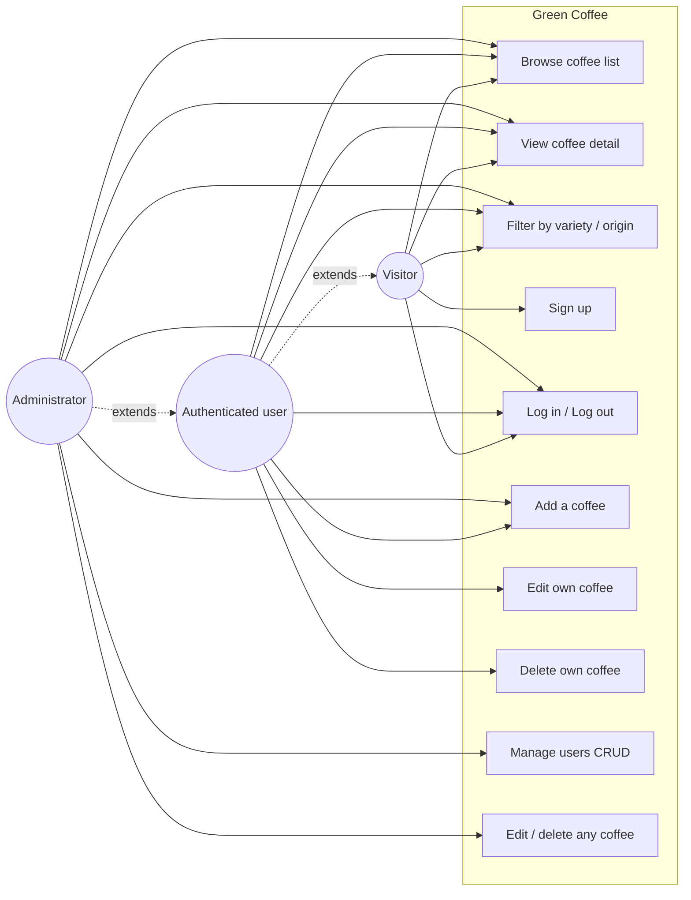
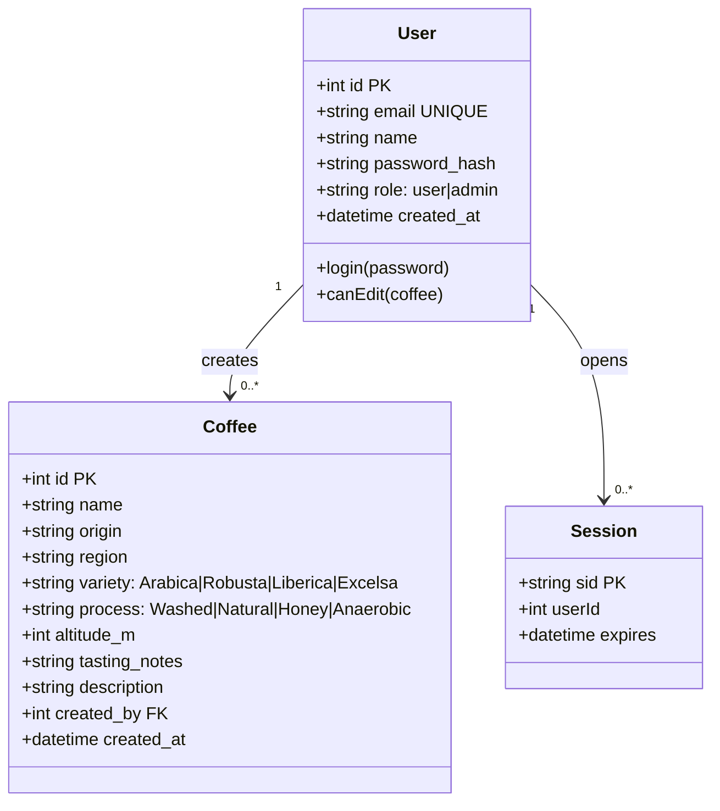
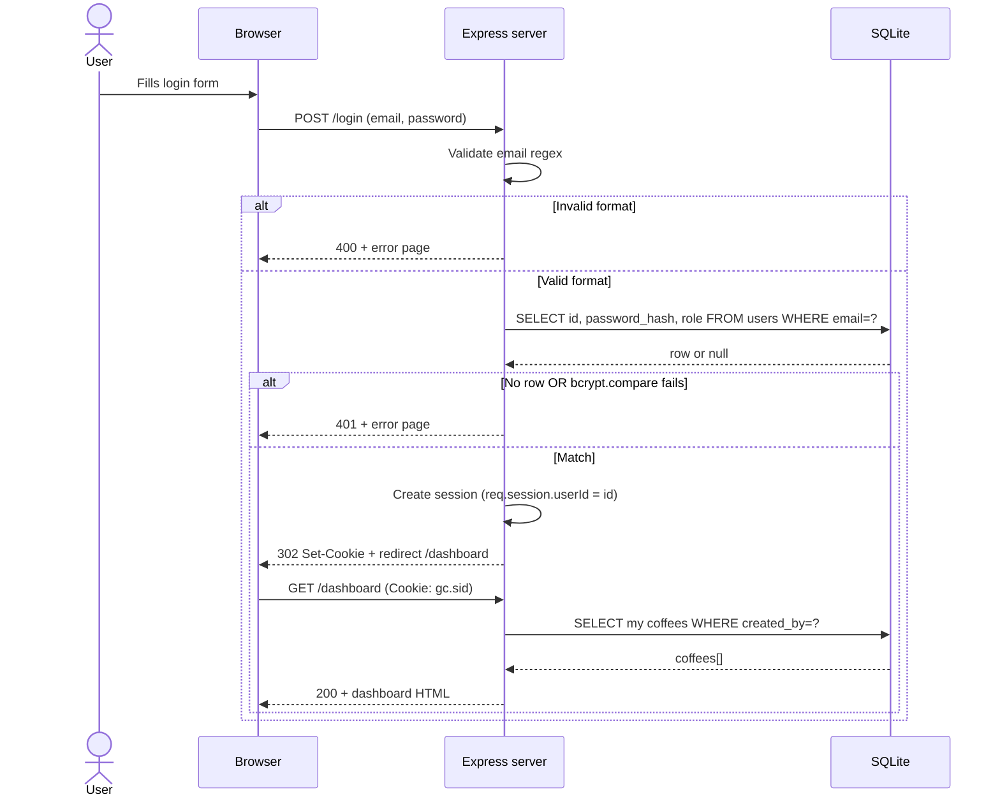
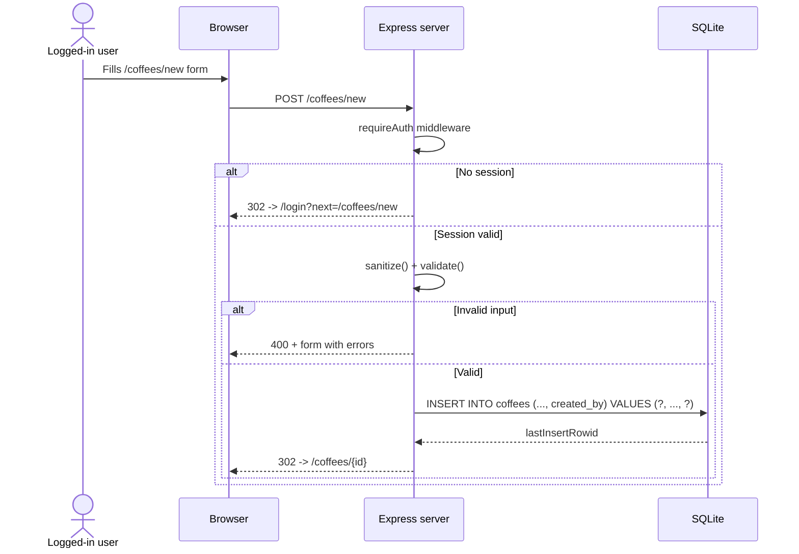
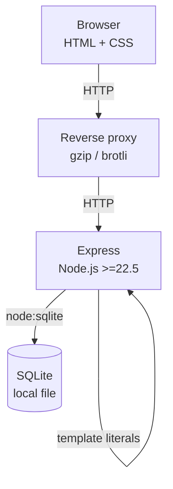

# UML diagrams

These diagrams use Mermaid syntax. They render natively on GitHub.

## 1. Use case diagram

## 2. Class diagram (logical data model)

## 3. Sequence diagram: log in

## 4. Sequence diagram: create a coffee

## 5. High-level architecture

